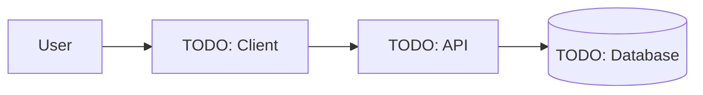

<div align="center">

# Project Name

**One-sentence description of what the project does and who it is for.**

[](LICENSE)
[](https://github.com/tunadeniz1304/SENG_429/actions/workflows/pr-checks.yml)


[Overview](#overview) · [Getting Started](#getting-started) · [Usage](#usage) · [Architecture](#architecture) · [Contributing](#contributing)

</div>

---

> [!NOTE]
> This README is a template. Replace every `TODO` and placeholder once the project scope is defined.

## Table of Contents

- [Overview](#overview)
- [Features](#features)
- [Tech Stack](#tech-stack)
- [Getting Started](#getting-started)
  - [Prerequisites](#prerequisites)
  - [Installation](#installation)
  - [Configuration](#configuration)
  - [Running Locally](#running-locally)
- [Usage](#usage)
- [Testing](#testing)
- [Architecture](#architecture)
- [Project Structure](#project-structure)
- [Roadmap](#roadmap)
- [Contributing](#contributing)
- [Team](#team)
- [License](#license)
- [Acknowledgements](#acknowledgements)

## Overview

TODO: Describe the problem, the target users, and how this project solves it (2–4 sentences).

This project is developed as part of the **SENG 429** course.

<!-- Screenshot or demo GIF:  -->

## Features

- [ ] TODO: Feature 1
- [ ] TODO: Feature 2
- [ ] TODO: Feature 3

## Tech Stack

| Layer          | Technology |
| -------------- | ---------- |
| Frontend       | TODO       |
| Backend        | TODO       |
| Database       | TODO       |
| Infrastructure | TODO       |
| Testing        | TODO       |

## Getting Started

### Prerequisites

- TODO: runtime / SDK and version (e.g. Node.js >= 20, Python >= 3.12)
- TODO: package manager
- Git

### Installation

```bash
git clone https://github.com/tunadeniz1304/SENG_429.git
cd SENG_429
# TODO: install dependencies
```

### Configuration

Copy the example environment file and fill in the values:

```bash
cp .env.example .env
```

| Variable   | Description | Required | Default |
| ---------- | ----------- | -------- | ------- |
| `TODO_VAR` | TODO        | Yes      | –       |

> [!WARNING]
> Never commit `.env` or any secret. It is ignored by `.gitignore`.

### Running Locally

```bash
# TODO: command to start the app
```

## Usage

TODO: Show the main use cases with examples, screenshots, or API calls.

## Testing

```bash
# TODO: command to run tests
```

## Architecture

TODO: High-level description of components and how they interact. Detailed design documents live in [`docs/`](docs/).



## Project Structure

```text
.
├── .github/          # CI workflows, PR/issue templates, CODEOWNERS
├── docs/             # Design docs, diagrams, reports
├── src/              # TODO: source code
├── tests/            # TODO: tests
├── CHANGELOG.md
├── CONTRIBUTING.md
├── LICENSE
└── README.md
```

## Roadmap

Development is organized into phases. Each phase ends with a tagged release (`v0.<phase>.0`).

| Phase | Goal | Status |
| ----- | ---- | ------ |
| P1    | TODO | Planned |
| P2    | TODO | Planned |
| P3    | TODO | Planned |

See [open issues](https://github.com/tunadeniz1304/SENG_429/issues) and [milestones](https://github.com/tunadeniz1304/SENG_429/milestones) for details.

## Contributing

`main` is protected: all changes go through a pull request with at least one approval.

- Branches: `P<phase>/<FeatureName>` (e.g. `P1/UserAuth`)
- PR titles: [Conventional Commits](https://www.conventionalcommits.org/) (e.g. `feat(auth): add login page`)

Read [CONTRIBUTING.md](CONTRIBUTING.md) for the full workflow before opening a PR.

## Team

| Name | Role | GitHub |
| ---- | ---- | ------ |
| TODO | TODO | [@tunadeniz1304](https://github.com/tunadeniz1304) |
| TODO | TODO | TODO |
| TODO | TODO | TODO |
| TODO | TODO | TODO |

## License

Distributed under the Apache License 2.0. See [LICENSE](LICENSE) and [NOTICE](NOTICE).

## Acknowledgements

- SENG 429 course staff
- TODO: libraries, resources, or people to credit
